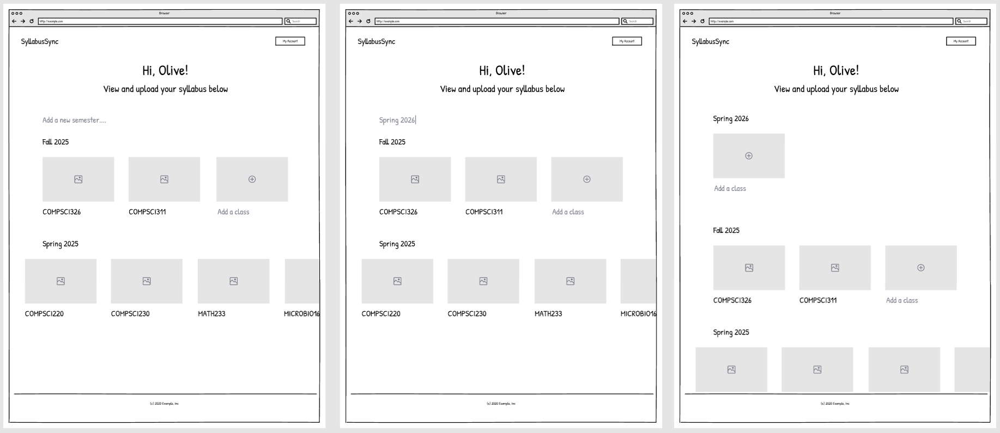
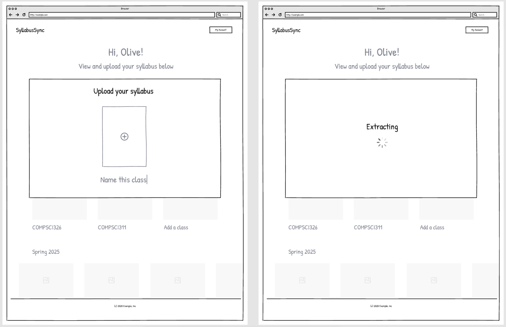

# SyllabusSync

**Extract syllabus content and automatically populate Notion pages.**  

SyllabusSync is a web application that streamlines the process of transferring course syllabus information into Notion. Upload a syllabus (PDF or DOCX), review and edit the extracted data inline, and sync it directly to your Notion workspace.  

---

## Features

- **Upload PDF or DOCX syllabus** for automated processing  
- **Inline preview and editing** of extracted syllabus fields  
- **Dynamic updates** using HTMX, no full page reloads required  
- **Sync to Notion** with a single click  
- **Hybrid extraction pipeline** combining Regex, heuristics, and optional LLM refinement for high accuracy  

---

## Tech Stack

- **Backend:** FastAPI  
- **Frontend:** HTMX + Tailwind CSS  
- **Integration:** Notion API  
- **Extraction:** Regex + heuristics + LLM for enhanced parsing

---
## Wireframes

1. On the main dashboard, the user can either add classes to the current semester or create a new semester and then add classes.

2. When the user clicks “Add a new class”, a window will pop up allowing them to upload their class syllabus. The system will then extract the core information

3. After extraction, the system will display the extracted results. Students can review and correct any errors before choosing a Notion template and importing the data into Notion

